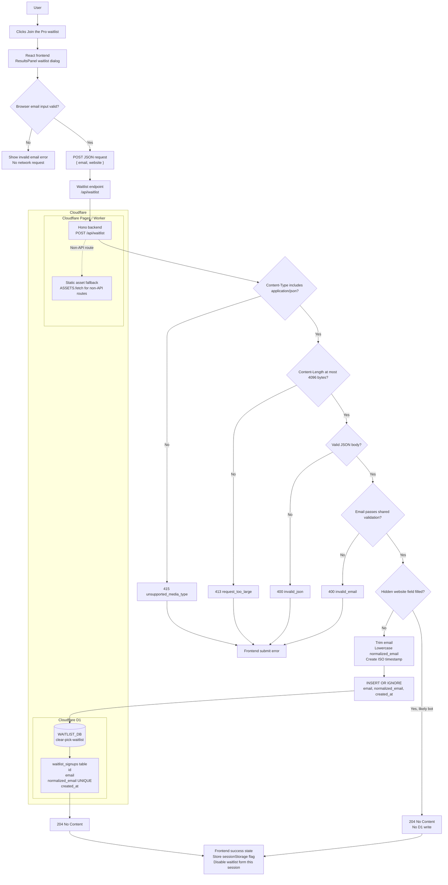

# Waitlist Feature Flow

```mermaid
flowchart TD
  user["User"] --> openDialog["Clicks Join the Pro waitlist"]
  openDialog --> dialog["React frontend<br/>ResultsPanel waitlist dialog"]

  dialog --> browserValidation{"Browser email input valid?"}
  browserValidation -->|"No"| invalidEmail["Show invalid email error<br/>No network request"]
  browserValidation -->|"Yes"| submit["POST JSON request<br/>{ email, website }"]

  submit --> endpoint["Waitlist endpoint<br/>/api/waitlist"]
  endpoint --> api

  subgraph cloudflare["Cloudflare"]
    subgraph pagesWorker["Cloudflare Pages / Worker"]
      api["Hono backend<br/>POST /api/waitlist"]
      assets["Static asset fallback<br/>ASSETS.fetch for non-API routes"]
    end

    subgraph d1["Cloudflare D1"]
      database[("WAITLIST_DB<br/>clear-pick-waitlist")]
      table["waitlist_signups table<br/>id<br/>email<br/>normalized_email UNIQUE<br/>created_at"]
    end
  end

  api --> contentType{"Content-Type includes application/json?"}
  contentType -->|"No"| unsupportedMedia["415 unsupported_media_type"]
  contentType -->|"Yes"| bodySize{"Content-Length at most 4096 bytes?"}

  bodySize -->|"No"| tooLarge["413 request_too_large"]
  bodySize -->|"Yes"| parseJson{"Valid JSON body?"}

  parseJson -->|"No"| invalidJson["400 invalid_json"]
  parseJson -->|"Yes"| validateEmail{"Email passes shared validation?"}

  validateEmail -->|"No"| invalidApiEmail["400 invalid_email"]
  validateEmail -->|"Yes"| honeypot{"Hidden website field filled?"}

  honeypot -->|"Yes, likely bot"| botNoWrite["204 No Content<br/>No D1 write"]
  honeypot -->|"No"| normalize["Trim email<br/>Lowercase normalized_email<br/>Create ISO timestamp"]

  normalize --> insert["INSERT OR IGNORE<br/>email, normalized_email, created_at"]
  insert --> database
  database --> table
  table --> successResponse["204 No Content"]

  successResponse --> frontendSuccess["Frontend success state<br/>Store sessionStorage flag<br/>Disable waitlist form this session"]
  botNoWrite --> frontendSuccess

  unsupportedMedia --> frontendError["Frontend submit error"]
  tooLarge --> frontendError
  invalidJson --> frontendError
  invalidApiEmail --> frontendError

  api -.->|"Non-API route"| assets
```
